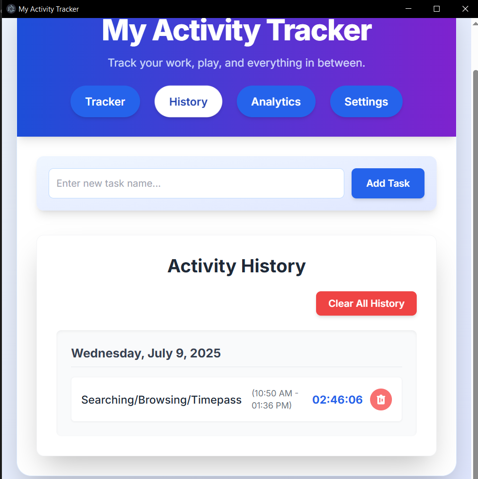

# My Activity Tracker Desktop App

<!-- Optional: Replace with a path to your actual app icon if you have one in the repo -->

A powerful and intuitive desktop application built with Electron.js, React, and Tailwind CSS to help you track your work, gaming, and other PC activities. This offline-first application provides detailed insights into your time usage, with robust data persistence, and easy import/export capabilities.

## 🧪Demo



## ✨ Features

- **Offline-First Data Storage:** All your activity data is stored locally on your machine using `localStorage`, ensuring privacy and accessibility without an internet connection.

- **Intuitive Task Management:** Easily add new tasks and select existing ones to track your time.

- **Real-time Timer:** A precise timer to record the duration of each activity session.

- **Comprehensive History:** View a detailed log of all your past activities, including start and end times, and duration. Includes options to delete individual entries or clear all history.

- **Powerful Analytics:** Gain insights into your productivity with a dashboard showing total time tracked, average daily activity, and time spent on each task.

- **Data Import/Export:** Export your entire dataset to a JSON file for backups or migration, and import data to restore your records.

- **Clean & Professional UI/UX:** Designed with Tailwind CSS for a modern, responsive, and easy-to-use interface.

- **Desktop Experience:** Packaged as a native Windows application (and extensible to macOS/Linux) for a seamless desktop experience, including a custom icon and hidden menu bar.

## 🚀 Getting Started

Follow these instructions to get a copy of the project up and running on your local machine for development and testing purposes.

### Prerequisites

Before you begin, ensure you have the following installed:

- **Node.js:** (LTS version recommended) - Includes npm. Download from [nodejs.org](https://nodejs.org/).

### Installation

1.  **Clone the repository:**

    ```bash
    git clone https://github.com/PRATHAMU200/MyActivityTrackerDesktop.git
    cd MyActivityTrackerDesktop

    ```

2.  **Install project dependencies:**
    This will install Electron, Electron Forge, and other necessary packages.

    ```bash
    npm install

    ```

3.  **Place your HTML file:**
    Ensure your main application HTML file (the `index.html` containing your React app code) is located in the `src/` directory of your project.

    Your project structure should look like this:

    ```
    MyActivityTrackerDesktop/
    ├── node_modules/
    ├── src/
    │   ├── index.html  <-- Your main app HTML file
    │   ├── main.js     <-- Electron's main process file
    ├── forge.config.js  <-- Electron's preload script
    ├── package.json
    └── package-lock.json

    ```

4.  **Prepare Electron Forge:**
    If you haven't already, import Electron Forge into your project. This sets up the necessary scripts and configurations.

    ```bash
    npx electron-forge import

    ```

## ▶️ Running the Application

### Development Mode

To run the application in development mode (with developer tools enabled):

```bash
npm start

```

This will open the Electron window, and you can use `Ctrl+Shift+I` (or `Cmd+Option+I` on macOS) to open the developer console for debugging.

### Running the Packaged Version (Portable)

After building (see "Building for Production" below), you can find a portable version of your app:

Navigate to `out/your-app-name-win32-x64/` (e.g., `out/my-activity-tracker-desktop-win32-x64/`).

Inside this folder, double-click the .exe file (e.g., my-activity-tracker-desktop.exe) to run the application directly without installation.

##📦 Building for Production (Creating the .exe Installer)
To create a distributable installer (.exe for Windows) for your application:

1. Ensure your `icon.ico` is in the` src/` folder.

Run the `make` command:

```Bash
npm run make
```

This command will:

- Bundle your application's code and the Electron runtime.

- Create an installer in the `out/` directory.

3. **Locate the Installer:**
   After the build process completes, you will find the installer in:
   `out/make/squirrel.windows/x64/`
   The installer file will typically be named something like `[Your Project Name]-[Version] Setup.exe` (e.g., `MyActivityTrackerDesktop-1.0.0 Setup.exe`).

   You can share this `.exe` file with others for them to install your application on their Windows machines.

## 💾 Data Persistence

The application uses `localStorage` for data storage. This means:

- Your tasks and activity history are saved directly on your computer.

- Data persists even when you close the application or shut down your PC.

- No internet connection or external database is required for data storage.

## 📥 Exporting and Importing Data

The application includes built-in functionality to manage your data:

- **Export:** On the "Settings" tab, click "Export Data to JSON" to download a `.json` file containing all your tasks and history. This is useful for backups or transferring data between machines.

- **Import:** On the "Settings" tab, click "Import Data from JSON" to select a previously exported `.json` file. **Be aware that importing data will overwrite your current local data.**

## ⚙️ Customization

- **Application Icon:** To change the application icon for both the window and the `.exe` installer, replace `src/icon.ico` with your desired `.ico` file. Ensure the `package.json` and `src/main.js` reference this file correctly as described in the previous instructions.

- **Window Size:** Adjust `width`, `height`, `minWidth`, and `minHeight` in `src/main.js` within the `BrowserWindow` options.

- **Menu Bar:** The default Electron menu bar is hidden by `autoHideMenuBar: true` in `src/main.js`. If you ever wish to re-enable it, set this to `false`.

## 💡 Future Enhancements (Ideas)

- **Task Editing/Deletion:** Implement functionality to edit or delete existing tasks.

- **More Advanced Analytics:** Add charts (e.g., daily activity bar charts, pie charts for task breakdown) using a library like `Chart.js`.

- **Reminders/Notifications:** Integrate desktop notifications for task reminders.

- **Theming:** Allow users to choose different color themes.

- **Cross-Platform Builds:** Configure Electron Forge to build for macOS and Linux as well.

## 🤝 Contributing

Feel free to fork this repository, open issues, or submit pull requests if you have suggestions or improvements!

## 📄 License

This project is licensed under the MIT License - see the `LICENSE` file (if you create one) for details.
